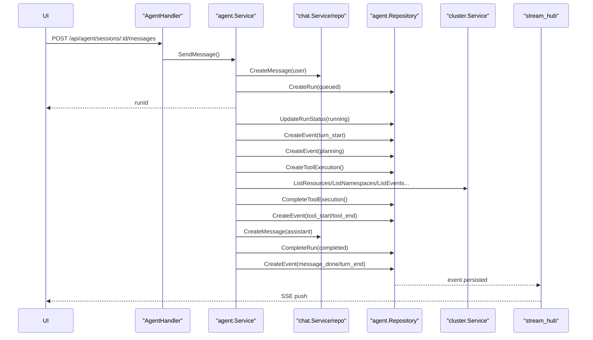
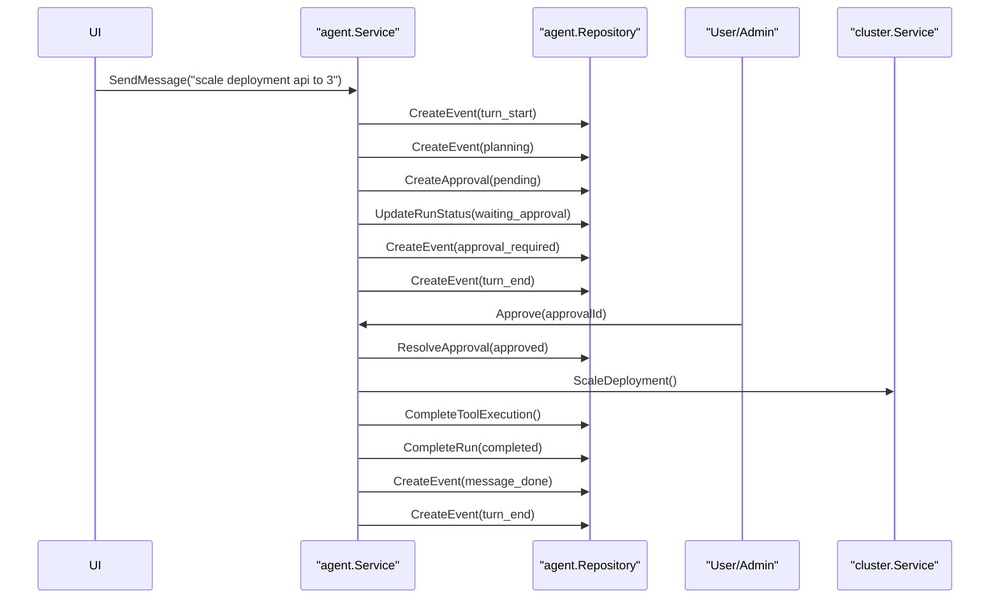

# Agent 流程代码走读

## 1. 文档目标

这份文档不是简单复述 API，而是把当前后端里的 Agent 真正执行链路串起来，回答 4 个问题：

1. 请求从哪里进来
2. 一次 Agent Run 在代码里怎么流转
3. 普通查询和变更审批两条链路分别怎么跑
4. 这套实现目前的优点、短板和后续优化点是什么

---

## 2. 先看整体结构

当前 Agent 的核心实现集中在下面几层：

- 应用装配层：`backend/internal/app/app.go`
- HTTP 路由层：`backend/internal/httpapi/router.go`
- Agent Handler：`backend/internal/httpapi/handlers/agent.go`
- Cluster Action Handler：`backend/internal/httpapi/handlers/cluster.go`
- Agent 业务核心：`backend/internal/application/agent/service.go`
- Chat 业务层：`backend/internal/application/chat/service.go`
- Cluster 业务层：`backend/internal/application/cluster/service.go`
- LLM 适配层：`backend/internal/infrastructure/llm/openai_compatible.go`
- Agent 仓储层：`backend/internal/infrastructure/mysql/repository/agent_repository.go`
- Chat 仓储层：`backend/internal/infrastructure/mysql/repository/chat_repository.go`
- 实时流 Hub：`backend/internal/infrastructure/agentruntime/stream_hub.go`

### 2.1 依赖装配

`app.New()` 在启动时把 Agent 依赖全部串起来：

- 创建 `streams := agentruntime.NewHub[applicationagent.Event]()`，用于 SSE 推送
- 创建 `chatService`
- 创建 `modelService`
- 创建 `clusterService`
- 创建 `skillService`
- 创建 `mcpService`
- 创建 `securityService`
- 创建 `agentService`
- 把 `agentService` 同时注入给：
  - `AgentHandler`
  - `ClusterHandler`

这意味着当前 Agent 并不是一个单独的微服务，而是后端进程内的一套业务编排模块。

关键代码位置：

- `backend/internal/app/app.go:72`
- `backend/internal/app/app.go:87`
- `backend/internal/app/app.go:111`
- `backend/internal/app/app.go:115`

---

## 3. 路由入口怎么分

### 3.1 Agent 路由

Agent 路由注册在 `registerAgentRoutes()`：

- `POST /api/agent/sessions`
- `GET /api/agent/sessions`
- `GET /api/agent/sessions/:id`
- `GET /api/agent/sessions/:id/messages`
- `POST /api/agent/sessions/:id/messages`
- `DELETE /api/agent/sessions/:id`
- `GET /api/agent/runs/:id/events`
- `GET /api/agent/runs/:id/stream`
- `POST /api/agent/approvals/:id/approve`
- `POST /api/agent/approvals/:id/reject`

代码位置：

- `backend/internal/httpapi/router.go:157`
- `backend/internal/httpapi/router.go:168`
- `backend/internal/httpapi/router.go:174`

### 3.2 Cluster Action 快捷入口

除了直接走 Agent 聊天入口，集群管理页还可以走专门的动作入口：

- `POST /api/clusters/:id/actions/delete-resource`
- `POST /api/clusters/:id/actions/scale-deployment`
- `POST /api/clusters/:id/actions/restart-deployment`
- `POST /api/clusters/:id/actions/apply-yaml`

这些接口并不直接执行集群变更，而是转成一条 Agent Session + Message，再复用同一套审批流程。

代码位置：

- `backend/internal/httpapi/router.go:148`
- `backend/internal/httpapi/router.go:149`
- `backend/internal/httpapi/router.go:150`
- `backend/internal/httpapi/router.go:151`

---

## 4. Agent 的核心数据模型

### 4.1 会话和消息

Agent 复用了 Chat 模块做会话承载：

- `chat_sessions`
- `chat_messages`

结构上最关键的是 `SessionContext`：

```go
type SessionContext struct {
    ModelID   *int64 `json:"modelId"`
    ClusterID *int64 `json:"clusterId"`
    Namespace string `json:"namespace"`
}
```

也就是说，一次 Agent 会话的执行上下文主要靠这 3 个字段驱动：

- 用哪个模型
- 针对哪个集群
- 默认命名空间是什么

### 4.2 Agent 执行态

Agent 自己维护 4 张执行相关表：

- `agent_runs`
- `agent_events`
- `approval_requests`
- `tool_executions`

它们的职责可以这样理解：

- `agent_runs`：一次用户消息对应一次 Run
- `agent_events`：Run 的时序事件流
- `approval_requests`：高风险动作的人工审批单
- `tool_executions`：一次工具调用的落库记录

模型定义位置：

- `backend/internal/infrastructure/mysql/models.go:202`
- `backend/internal/infrastructure/mysql/models.go:215`
- `backend/internal/infrastructure/mysql/models.go:229`
- `backend/internal/infrastructure/mysql/models.go:246`
- `backend/internal/infrastructure/mysql/models.go:268`
- `backend/internal/infrastructure/mysql/models.go:285`

---

## 5. 一次普通 Agent 请求怎么跑

下面先看最常见的链路：用户创建会话，发一条读操作问题，比如“列出 default 命名空间的 pods”。

### 5.1 创建会话

入口：`AgentHandler.CreateSession()`

请求体里会带：

- `title`
- `modelId`
- `clusterId`
- `namespace`

Handler 做的事很轻：

1. 取当前用户
2. 绑定 JSON
3. 调 `agentService.CreateSession()`

而 `agentService.CreateSession()` 本质上只是转调 `chatService.CreateSession()`。

关键代码位置：

- `backend/internal/httpapi/handlers/agent.go:26`
- `backend/internal/application/agent/service.go:228`
- `backend/internal/application/chat/service.go:71`
- `backend/internal/infrastructure/mysql/repository/chat_repository.go:45`

### 5.2 发送消息

入口：`AgentHandler.SendMessage()`

Handler 做了 5 件事：

1. 校验当前用户
2. 校验 session 是否存在
3. 校验 session 是否归当前用户所有
4. 读取消息内容
5. 调 `agentService.SendMessage()`

关键代码位置：

- `backend/internal/httpapi/handlers/agent.go:133`

### 5.3 SendMessage 内部动作

`agentService.SendMessage()` 是正式进入编排的起点，它做了下面几步：

1. 读取会话
2. 如果 `session.Context.ModelID == nil`，尝试补默认模型
3. 在 `chat_messages` 里写入一条 `role=user` 消息
4. 在 `agent_runs` 里创建一条 `queued` Run
5. 异步启动 `go s.executeRun(...)`
6. 立刻把 `runId` 返回给前端

这一步非常关键，因为它决定了当前 Agent 是“异步执行模型”：

- HTTP 请求不等待最终答案
- 前端依赖 `runId` 去订阅 SSE 或轮询事件

关键代码位置：

- `backend/internal/application/agent/service.go:260`

---

## 6. executeRun 是真正的主流程

`executeRun()` 是整个 Agent 的主状态机。

代码位置：

- `backend/internal/application/agent/service.go:380`

它的执行步骤可以概括成：

1. 把 Run 状态更新成 `running`
2. 发出 `turn_start`
3. 调 `analyzeIntent()` 做意图分析
4. 发出 `planning`
5. 如果需要审批：
   - 创建 `approval_requests`
   - 更新 Run 为 `waiting_approval`
   - 发 `approval_required`
   - 发 `turn_end`
   - 结束本轮
6. 如果不需要审批：
   - 执行 `executeIntent()`
   - 写入 assistant 消息
   - 完成 Run
   - 发 `message_delta`
   - 发 `message_done`
   - 发 `turn_end`

### 6.1 时序图：普通查询



---

## 7. 意图分析怎么做

### 7.1 第一层：模型规划器

`analyzeIntent()` 先调用 `planIntentWithModel()`。

代码位置：

- `backend/internal/application/agent/service.go:829`
- `backend/internal/application/agent/service.go:862`

这里会：

1. 解析当前会话上下文
2. 调用当前模型的 `llm.Chat()`
3. 要求模型只返回一个 JSON 规划结果
4. 把结果映射成内部 `intent`

规划器可返回的 kind：

- `list_namespaces`
- `list_resources`
- `list_events`
- `list_models`
- `list_skills`
- `list_mcp`
- `delete_resource`
- `scale_deployment`
- `restart_deployment`
- `apply_yaml`
- `llm`

### 7.2 第二层：规则兜底

如果模型规划失败，就进入规则兜底：

- `detectRiskyIntent()` 识别高风险动作
- `heuristicIntent()` 识别普通只读动作

代码位置：

- `backend/internal/application/agent/service.go:994`
- `backend/internal/application/agent/service.go:947`

这意味着当前实现是“双轨路由”：

- 优先让模型理解用户意图
- 模型不稳定时再用关键词规则兜住基本功能

### 7.3 敏感词检查

`detectSensitiveReview()` 会读取安全模块中的敏感词表，如果命中就要求人工审批。

代码位置：

- `backend/internal/application/agent/service.go:981`
- `backend/internal/application/security/service.go`

---

## 8. 普通只读请求如何执行

如果意图是下面这些只读动作：

- `list_namespaces`
- `list_resources`
- `list_events`
- `list_models`
- `list_skills`
- `list_mcp`

那么 `executeIntent()` 会走 `executeToolIntent()`。

代码位置：

- `backend/internal/application/agent/service.go:489`
- `backend/internal/application/agent/service.go:498`

### 8.1 executeToolIntent 做了什么

1. 在 `tool_executions` 落一条记录
2. 发 `agent_spawn`
3. 发 `tool_start`
4. 调 `runTool()`
5. 回填 `tool_executions`
6. 发 `tool_end`
7. 发 `agent_result`
8. 把结果字符串返回给主流程

### 8.2 runTool 当前支持的工具

`runTool()` 目前是硬编码 switch：

- `cluster.list_namespaces`
- `cluster.list_resources`
- `cluster.list_events`
- `model.list`
- `skill.list`
- `mcp.list`

代码位置：

- `backend/internal/application/agent/service.go:643`

注意一点：这里的“工具”不是一个可扩展的 Tool Registry，也不是动态函数调用框架，而是代码里的固定分支。

---

## 9. 普通聊天问答如何执行

如果意图不是只读工具，而是普通对话，那么 `executeIntent()` 会走 `executeLLMIntent()`。

代码位置：

- `backend/internal/application/agent/service.go:536`

### 9.1 executeLLMIntent 的步骤

1. 解析当前会话绑定的模型
2. 读取完整聊天历史
3. 先拼一条 `system` 提示词
4. 把历史中的 `user/assistant/system` 消息送给模型
5. 调 `llm.Chat()`
6. 用 `sanitizeLLMOutput()` 清理 `<think>` 内容
7. 把最终文本返回

### 9.2 LLM 适配层

底层调用走的是 OpenAI 兼容协议：

- 请求地址：`<baseURL>/chat/completions`
- 通过 `Authorization: Bearer <apiKey>` 注入凭证
- 当前固定 `stream=false`

代码位置：

- `backend/internal/infrastructure/llm/openai_compatible.go`

所以当前系统虽然叫 Agent，但普通问答本质上还是：

- 先做意图规划
- 再走一次普通 Chat Completion

---

## 10. 变更型请求怎么走审批

下面看第二条主线：比如用户说“把 prod 命名空间的 api deployment 扩容到 3 个副本”。

### 10.1 风险识别

如果命中以下动作：

- 删除资源
- 扩缩容
- 重启 deployment
- apply yaml
- 命中敏感词

`executeRun()` 不会直接执行，而是先创建审批单。

代码位置：

- `backend/internal/application/agent/service.go:397`

### 10.2 审批态的事件流

Run 会进入 `waiting_approval`，并发出：

- `approval_required`
- `turn_end`

前端随后可以：

- 拉取 `/api/agent/runs/:id/events`
- 或订阅 `/api/agent/runs/:id/stream`

拿到审批单信息。

### 10.3 审批接口

审批由下面两个接口驱动：

- `POST /api/agent/approvals/:id/approve`
- `POST /api/agent/approvals/:id/reject`

代码位置：

- `backend/internal/httpapi/handlers/agent.go:302`
- `backend/internal/httpapi/handlers/agent.go:346`

### 10.4 审批通过后

`Approve()` 里会：

1. 把审批状态改成 `approved`
2. 读取 Run
3. 读取 Session
4. 异步启动 `executeApprovedAction()`

代码位置：

- `backend/internal/application/agent/service.go:333`
- `backend/internal/application/agent/service.go:454`

### 10.5 executeApprovedAction / executeApprovedPayload

审批通过后，真正的执行发生在 `executeApprovedPayload()`：

- `delete_resource` -> `clusters.DeleteResource()`
- `scale_deployment` -> `clusters.ScaleDeployment()`
- `restart_deployment` -> `clusters.RestartDeployment()`
- `apply_yaml` -> `clusters.ApplyYAML()`

代码位置：

- `backend/internal/application/agent/service.go:587`
- `backend/internal/application/agent/service.go:602`

### 10.6 时序图：审批型请求



---

## 11. SSE 实时流怎么工作

### 11.1 历史事件 + 实时订阅

`StreamRun()` 的做法比较实用：

1. 先查数据库里的历史事件
2. 逐条回放给前端
3. 再订阅内存 Hub
4. 把新事件继续通过 SSE 推给前端

代码位置：

- `backend/internal/httpapi/handlers/agent.go:244`
- `backend/internal/infrastructure/agentruntime/stream_hub.go`

这样前端不怕“晚连一拍”，因为老事件能补回来。

### 11.2 事件发布机制

所有事件统一走 `publishEvent()`：

1. 先写 `agent_events`
2. 再写日志
3. 再推送到 `stream_hub`

代码位置：

- `backend/internal/application/agent/service.go:793`

这个设计有个好处：事件流既能实时看，也能追溯。

---

## 12. Cluster Action 快捷入口是怎么复用 Agent 的

`ClusterHandler.RequestDeleteResource()`、`RequestScaleDeployment()` 等方法本质上做的不是直接执行，而是：

1. 根据 clusterId + 用户身份拼一个 `ClusterActionRequestInput`
2. 调 `agentService.RequestClusterAction()`
3. `RequestClusterAction()` 先创建一个新的 Agent Session
4. 再把动作翻译成一条自然语言消息
5. 最后复用 `SendMessage()`

代码位置：

- `backend/internal/httpapi/handlers/cluster.go:335`
- `backend/internal/httpapi/handlers/cluster.go:375`
- `backend/internal/httpapi/handlers/cluster.go:415`
- `backend/internal/httpapi/handlers/cluster.go:453`
- `backend/internal/application/agent/service.go:311`

这也是当前实现里一个很漂亮的点：

- 页面按钮触发的动作
- 聊天里输入的动作

最终走的是同一条审批执行链路。

---

## 13. 具体操作演示

下面给出两组演示命令。假设：

- 服务地址是 `http://localhost:8080`
- 已经有可用的 `ACCESS_TOKEN`
- 集群 ID 为 `1`
- 模型 ID 为 `1`

### 13.1 演示一：读操作，列出 pods

#### 第一步：创建会话

```bash
curl -X POST http://localhost:8080/api/agent/sessions \
  -H "Authorization: Bearer $ACCESS_TOKEN" \
  -H "Content-Type: application/json" \
  -d '{
    "title": "prod 排查",
    "modelId": 1,
    "clusterId": 1,
    "namespace": "default"
  }'
```

预期拿到：

```json
{
  "data": {
    "id": 101,
    "title": "prod 排查",
    "context": {
      "modelId": 1,
      "clusterId": 1,
      "namespace": "default"
    }
  }
}
```

#### 第二步：发送消息

```bash
curl -X POST http://localhost:8080/api/agent/sessions/101/messages \
  -H "Authorization: Bearer $ACCESS_TOKEN" \
  -H "Content-Type: application/json" \
  -d '{
    "content": "列出 default 命名空间下的 pods"
  }'
```

预期拿到：

```json
{
  "data": {
    "sessionId": 101,
    "userMessageId": 9001,
    "runId": 3001,
    "status": "queued"
  }
}
```

#### 第三步：订阅事件流

```bash
curl -N http://localhost:8080/api/agent/runs/3001/stream \
  -H "Authorization: Bearer $ACCESS_TOKEN"
```

你通常会依次看到：

- `turn_start`
- `planning`
- `agent_spawn`
- `tool_start`
- `tool_end`
- `agent_result`
- `message_done`
- `turn_end`

#### 第四步：查看最终消息

```bash
curl http://localhost:8080/api/agent/sessions/101/messages \
  -H "Authorization: Bearer $ACCESS_TOKEN"
```

最终 assistant 内容通常会是一段格式化 JSON 字符串。

### 13.2 演示二：变更操作，扩容 deployment

#### 方式 A：直接通过 Agent 聊天发起

```bash
curl -X POST http://localhost:8080/api/agent/sessions/101/messages \
  -H "Authorization: Bearer $ACCESS_TOKEN" \
  -H "Content-Type: application/json" \
  -d '{
    "content": "把 default 命名空间的 api deployment 扩容到 3 个副本"
  }'
```

这次事件流里会出现：

- `turn_start`
- `planning`
- `approval_required`
- `turn_end`

#### 方式 B：通过 Cluster Action 快捷接口发起

```bash
curl -X POST http://localhost:8080/api/clusters/1/actions/scale-deployment \
  -H "Authorization: Bearer $ACCESS_TOKEN" \
  -H "Content-Type: application/json" \
  -d '{
    "name": "api",
    "namespace": "default",
    "replicas": 3
  }'
```

这个接口内部同样会创建 Agent Session 并触发审批。

#### 第三步：先拉事件，找到 approvalId

```bash
curl http://localhost:8080/api/agent/runs/3002/events \
  -H "Authorization: Bearer $ACCESS_TOKEN"
```

在 `approval_required` 事件的 payload 里可以看到：

```json
{
  "approvalId": 501,
  "type": "scale_deployment",
  "title": "scale deployment",
  "payload": {
    "name": "api",
    "namespace": "default",
    "replicas": 3
  }
}
```

#### 第四步：审批通过

```bash
curl -X POST http://localhost:8080/api/agent/approvals/501/approve \
  -H "Authorization: Bearer $ACCESS_TOKEN"
```

#### 第五步：再次拉事件

```bash
curl http://localhost:8080/api/agent/runs/3002/events \
  -H "Authorization: Bearer $ACCESS_TOKEN"
```

你会看到 Run 最终进入 `completed`，assistant 消息类似：

```text
Scaled deployment api in namespace default to 3 replicas.
```

---

## 14. 这套实现的优点

### 14.1 分层比较清楚

路由、Handler、应用服务、仓储、基础设施分层明确，读代码时边界清晰。

### 14.2 Agent 和 Chat 解耦得不错

Agent 不重复造会话轮子，直接复用 Chat 的 Session / Message 存储，这让：

- 多轮上下文天然存在
- 前后端展示消息列表更简单
- Agent 和普通聊天未来可以共用更多能力

### 14.3 事件流设计很实用

`agent_events` + `stream_hub` 的组合兼顾了：

- 实时推送
- 历史追溯
- 失败排查

对前端体验和问题定位都很友好。

### 14.4 审批流程被抽成通用能力

聊天输入动作和按钮动作，最终都归一到同一条 Agent 流程，减少了重复实现。

### 14.5 有现实可用的安全意识

虽然还不够强，但至少已经有：

- 风险动作审批
- 敏感词拦截
- `<think>` 输出清理
- requestId
- 审批审计日志

这说明当前实现不是“只跑通 happy path”，而是开始考虑生产约束了。

### 14.6 规则兜底增强了稳定性

模型规划失败时还能回退到关键词规则，这让系统对模型质量没那么脆弱。

---

## 15. 这套实现的短板和风险

### 15.1 Agent 路由可能绕过集群权限边界

这是当前最需要重视的问题。

现状是：

- `/api/agent/**` 只要求登录即可访问
- `/api/clusters/**` 则要求 `admin` 或 `cluster_admin`
- 但 Agent 内部调用 `clusterService`
- `clusterService` 又直接通过 `clusterRepo.GetConnection()` 读取集群连接
- 这个读取过程没有看到用户维度的权限校验

意味着只要普通用户能创建一个带 `clusterId` 的 Agent Session，就有机会通过 Agent 间接访问集群。

关键代码位置：

- `backend/internal/httpapi/router.go:30`
- `backend/internal/httpapi/router.go:62`
- `backend/internal/application/agent/service.go:643`
- `backend/internal/application/cluster/service.go`
- `backend/internal/infrastructure/mysql/repository/cluster_repository.go:47`

### 15.2 Run 是 goroutine 异步执行，缺少任务恢复能力

`SendMessage()` 和 `Approve()` 都直接 `go s.execute...`：

- 请求取消不会取消任务
- 进程重启后不会恢复未完成 Run
- 没有队列、重试、超时治理
- 没有并发上限

这对 demo 很友好，但对生产型 Agent 还不够。

关键代码位置：

- `backend/internal/application/agent/service.go:301`
- `backend/internal/application/agent/service.go:348`

### 15.3 普通对话要调用两次模型，成本和延迟偏高

现在一条普通聊天消息通常要经历：

1. `planIntentWithModel()` 先调用一次模型
2. `executeLLMIntent()` 再调用一次模型

这样会带来：

- 更高延迟
- 更高 token 成本
- 模型配置错误时，规划和回答一起受影响

### 15.4 工具系统是硬编码的，不是真正的可扩展 Agent Tooling

`runTool()` 目前是固定 switch，MCP 和 Skill 也只是“列出记录”，不是“真正可执行”。

这说明当前 Agent 更接近：

- 带审批和事件流的编排器

还不是：

- 可插拔工具生态型 Agent Runtime

### 15.5 审批通过后的事件不够细

普通只读工具执行时会发：

- `tool_start`
- `tool_end`
- `agent_result`

但审批通过后的执行链路里，`executeApprovedPayload()` 只写 `tool_executions`，没有发布同等级别的事件。

结果就是：

- 前端能看到“审批通过，开始执行”
- 但看不到变更动作内部的细粒度状态

### 15.6 敏感词审批分支有逻辑断点

`detectSensitiveReview()` 会返回 `manual_review` 类型审批。

但 `executeApprovedPayload()` 只支持：

- `delete_resource`
- `scale_deployment`
- `restart_deployment`
- `apply_yaml`

如果审批单类型是 `manual_review`，审批通过后会走到默认分支，直接报：

- `unsupported approved action: manual_review`

这是一个明确的逻辑漏洞。

相关代码位置：

- `backend/internal/application/agent/service.go:981`
- `backend/internal/application/agent/service.go:630`

### 15.7 审计覆盖面不完整

当前审批接口会追加审计记录，但普通 Agent 对话、只读集群访问、LLM 调用本身并没有完整进入审计闭环。

对于运维型 Agent，这块后面大概率还要补强。

### 15.8 Stream Hub 会丢事件

`stream_hub.Publish()` 用的是非阻塞写：

```go
select {
case ch <- value:
default:
}
```

如果消费者太慢，事件会直接被丢弃。

这对“页面实时展示”问题不大，因为还能补历史，但对严格流式 UI 来说会出现跳帧。

### 15.9 queued 状态和 startedAt 的语义有点混

创建 Run 时状态是 `queued`，但仓储层已经把 `StartedAt` 写进去了；后面真正运行时又会更新一次。

这会让：

- 排队时长
- 真正开始执行时间

在数据语义上变得不够清晰。

---

## 16. 我的结论

如果用一句话概括这套实现：

它已经不是“假聊天框”了，而是一套能落库、能审批、能推流、能调集群和模型的 Agent 编排雏形。

它最强的地方在于：

- 主链路清楚
- 事件流清楚
- 审批链路闭环
- 前后端联调成本低

它最需要尽快补的地方在于：

1. Agent 到 Cluster 的权限校验
2. 审批通过后的事件细化
3. `manual_review` 审批分支补齐
4. 从 goroutine 升级到可恢复的任务执行器
5. 从硬编码工具切到可扩展 Tool Registry

---

## 17. 推荐你接下来怎么继续看代码

如果你要自己继续深入，我建议按这个顺序读：

1. `backend/internal/httpapi/handlers/agent.go`
2. `backend/internal/application/agent/service.go`
3. `backend/internal/application/chat/service.go`
4. `backend/internal/infrastructure/mysql/repository/chat_repository.go`
5. `backend/internal/infrastructure/mysql/repository/agent_repository.go`
6. `backend/internal/application/cluster/service.go`
7. `backend/internal/infrastructure/llm/openai_compatible.go`
8. `backend/internal/infrastructure/agentruntime/stream_hub.go`

这样你会最快建立“入口 -> 状态 -> 存储 -> 外部调用”的完整心智模型。
