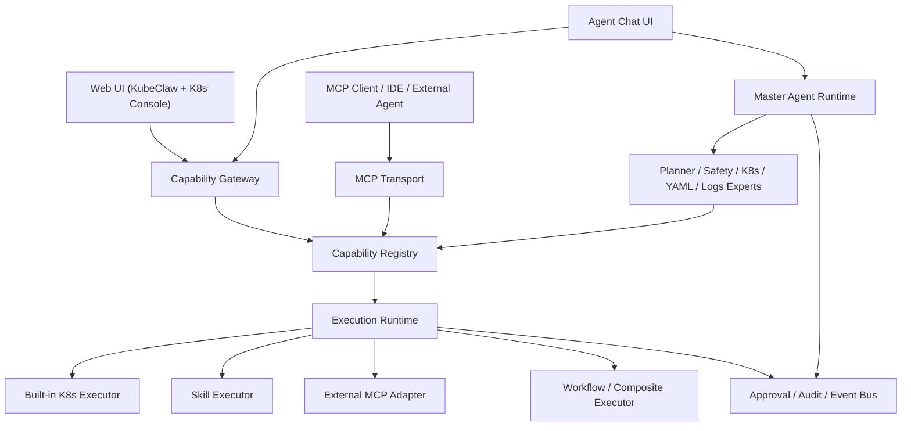
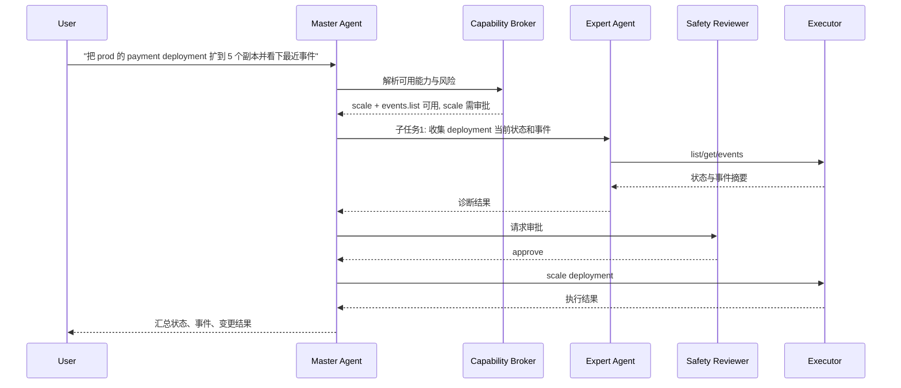

# KubeClaw 统一生态改造可行性报告

## 1. 结论先说

这个方向是可行的，而且我认为值得做。

但可行的前提不是把 `kubesphere`、`console`、`kubernetes-mcp-server`、`picoclaw` 四个项目硬合并成一个巨型工程，而是把它们拆成 4 类资产，再围绕一条统一的能力总线重组：

- `KubeClaw` 负责产品壳、租户/权限、审计、Agent 会话、平台编排
- `kubernetes-mcp-server` 负责沉淀 K8s 能力 schema、toolset、MCP/HTTP transport 思路
- `picoclaw` 负责沉淀 master/subagent/subturn/context budget/event bus 运行时思路
- `console` 负责沉淀成熟的 K8s 面板 UI，而不是带整套 KubeSphere 业务域

如果按这个方式改造，最终可以形成一个统一生态：

- 同一套 K8s 细粒度能力
- 同时被 Web 面板、HTTP API、MCP Tools、Agent Chat 调用
- 同一套审批、审计、权限、事件流
- 同一个产品壳下同时支持“传统功能操作”和“Agent 对话操作”

我不建议做“一次性大重写”，建议做“能力层先统一，再逐层替换入口”的分阶段演进。

---

## 2. 当前四个项目分别能贡献什么

### 2.1 `kubeclaw`

它已经有一套自己的产品骨架，不能丢。

已经具备的核心资产：

- 用户、团队、租户、模型、技能、MCP 配置、审计等业务壳
- Agent 会话、Run、事件流、审批流
- 现有 K8s 查询与变更能力
- 简单但可用的 Web 管理前端

我在当前代码里确认到的代表性位置：

- Agent 服务入口：`C:\Users\admin\Desktop\kubeclaw\backend\internal\application\agent\service.go`
- Agent capability 装配：`C:\Users\admin\Desktop\kubeclaw\backend\internal\application\agent\capabilities.go`
- Cluster HTTP 接口：`C:\Users\admin\Desktop\kubeclaw\backend\internal\httpapi\handlers\cluster.go`
- K8s Gateway：`C:\Users\admin\Desktop\kubeclaw\backend\internal\infrastructure\kubernetes\gateway.go`
- 前端 Agent 页：`C:\Users\admin\Desktop\kubeclaw\frontend\src\features\agent\AgentPage.tsx`

它的问题不是“什么都没有”，而是：

- 能力模型还不够统一
- Agent orchestration 还是单服务思维
- Web UI 和 Agent Chat 还是两套相对独立的入口
- K8s 面板深度远不如 `console`

### 2.2 `kubernetes-mcp-server`

这是最适合做“底层 K8s capability schema”参考实现的项目。

我确认到的关键事实：

- 它不是简单包一层 `kubectl`，而是原生 Go 的 K8s 能力服务
- 它已经把能力抽象成 `Toolset -> Tool -> JSON Schema -> Handler`
- 它同时支持 stdio、SSE、streamable HTTP 等传输形态
- 它的工具有 read-only / destructive / idempotent / open-world 语义注解

代表性代码：

- MCP Server 组装：`C:\Users\admin\Desktop\kubernetes-mcp-server\pkg\mcp\mcp.go`
- Toolset 接口：`C:\Users\admin\Desktop\kubernetes-mcp-server\pkg\api\toolsets.go`
- 参数与 schema 辅助：`C:\Users\admin\Desktop\kubernetes-mcp-server\pkg\api\params.go`
- K8s Client 抽象：`C:\Users\admin\Desktop\kubernetes-mcp-server\pkg\api\kubernetes.go`
- Core toolset 注册：`C:\Users\admin\Desktop\kubernetes-mcp-server\pkg\toolsets\core\toolset.go`
- 资源 CRUD/scale 等能力：`C:\Users\admin\Desktop\kubernetes-mcp-server\pkg\toolsets\core\resources.go`
- HTTP/SSE 服务：`C:\Users\admin\Desktop\kubernetes-mcp-server\pkg\http\http.go`

这个项目最值得借的不是“整个项目”，而是下面 3 个思想：

- 能力要先 schema 化，再谈 Agent 和 UI
- 同一能力要能暴露成不同 transport，而不是每个入口自己重写逻辑
- 工具元数据要能表达风险级别、幂等性、只读性

### 2.3 `picoclaw`

这是最适合做“多 Agent 运行时参考”的项目。

它最有价值的不是页面，而是运行时语义：

- `AgentLoop`
- `SubTurn`
- `EventBus`
- `Context Budget`
- `Tool Registry`
- `SubagentManager`

我确认到的关键位置：

- Agent 定义与 persona：`C:\Users\admin\Desktop\picoclaw\pkg\agent\definition.go`
- Agent 实例与共享工具注册：`C:\Users\admin\Desktop\picoclaw\pkg\agent\instance.go`
- 主循环：`C:\Users\admin\Desktop\picoclaw\pkg\agent\loop.go`
- SubTurn 运行时：`C:\Users\admin\Desktop\picoclaw\pkg\agent\subturn.go`
- EventBus：`C:\Users\admin\Desktop\picoclaw\pkg\agent\eventbus.go`
- Context Budget：`C:\Users\admin\Desktop\picoclaw\pkg\agent\context_budget.go`
- Spawn tool：`C:\Users\admin\Desktop\picoclaw\pkg\tools\spawn.go`
- Subagent manager：`C:\Users\admin\Desktop\picoclaw\pkg\tools\subagent.go`
- Agent refactor 设计意图：`C:\Users\admin\Desktop\picoclaw\docs\agent-refactor\README.md`

这套设计对你当前目标特别契合，因为它已经证明了一件事：

- 多 agent 不一定要多进程
- 先把 turn/subturn、上下文预算、事件边界、工具边界做清楚，就能支撑 master/expert/subagent 的协同

尤其适合吸收的几个点：

- 子任务使用独立 ephemeral session，避免污染父会话历史
- 有 depth、concurrency、timeout、token budget 控制
- 支持异步子任务回传
- 事件总线天然适合前端时间线和可观测性

### 2.4 `console`

它最适合扮演“成熟 K8s 管理前端壳”。

关键原因：

- 它的页面已经把 K8s 核心管理场景做得比较完整
- 它是路由与配置驱动的，可以裁掉非核心域
- 它的请求层、store 层、导航层相对统一

我确认过的关键位置：

- Cluster 路由：`C:\Users\admin\Desktop\console\packages\console\src\pages\clusters\routes\index.tsx`
- Project 路由：`C:\Users\admin\Desktop\console\packages\console\src\pages\projects\routes\index.tsx`
- Store 基类：`C:\Users\admin\Desktop\console\packages\shared\src\stores\store.ts`
- 请求适配：`C:\Users\admin\Desktop\console\packages\shared\src\utils\request.ts`
- URL 构造：`C:\Users\admin\Desktop\console\packages\shared\src\hooks\useUrl\index.ts`
- 权限/导航处理：`C:\Users\admin\Desktop\console\packages\shared\src\stores\permission.ts`
- 服务端配置：`C:\Users\admin\Desktop\console\server\configs\config.yaml`

其中 `config.yaml` 已经能看出，核心 K8s 面板完全可以裁出来，只保留：

- overview
- nodes
- projects
- deployments/statefulsets/daemonsets
- pods
- services
- ingresses
- configmaps/secrets/serviceaccounts
- volumes/storageclasses
- events/logs

不需要带上：

- appstore
- marketplace
- workspace/IAM 全套
- devops
- 可观测性扩展域

### 2.5 `kubesphere`

它更适合做“后端设计参考”，不适合整体迁入。

更准确地说，它有价值的是：

- 多集群 client/cache 的思路
- 资源 getter / registry 的思路
- 统一资源 API 的建模思路

不建议强迁的部分：

- IAM / RBAC / workspace / tenant 整体体系
- 平台级授权模型
- 扩展生态和模块依赖

---

## 3. 你的目标需求，拆成什么问题最合理

你现在的目标，本质上不是一个需求，而是 5 个层次的需求叠加：

### 3.1 底层能力统一

你希望：

- K8s 细粒度操作先变成统一 schema
- 同一能力既能 HTTP 调用，也能 MCP 调用
- 多个细粒度能力还能组合成高阶操作

例子：

- `get deployment`
- `get pod logs`
- `patch replicas`
- `apply yaml`
- `wait rollout`

这些细粒度能力可以组合成更高阶的：

- `scale deployment`
- `restart deployment`
- `blue/green apply`
- `diagnose rollout failure`

### 3.2 Agent 运行时升级

你希望：

- 有一个 master agent 接收任务
- master 把任务拆给 subagent 或专家 agent
- 每层只传必要上下文
- 防止长任务把上下文撑爆

### 3.3 Web 与 Chat 共用同一能力层

你不想维护两套业务逻辑。

你希望：

- Web 页面点按钮，是在调用统一能力层
- Agent Chat 对话调用能力，也是调用同一能力层
- 页面组件可以被 Agent 场景复用

例子：

- Agent 识别“打开 deployment YAML 编辑器”
- 前端直接弹出和 Web 页面同一套 YAML 组件
- Agent 继续监听保存结果或 apply 结果

### 3.4 K8s 面板增强

你希望把成熟的 K8s 基础管理能力拿过来，但不要把 KubeSphere 全平台拖进来。

也就是：

- 只要核心 K8s 管理面板
- 不要包管理器、应用商店、包仓库等杂项

### 3.5 产品壳统一

最终你要的是一个统一生态，而不是几个拼装页面：

- 同一登录与权限模型
- 同一审计与审批模型
- 同一能力注册中心
- 同一事件/日志/观测面板

---

## 4. 可行性判断

### 4.1 结论

可行，而且技术路径是清晰的。

### 4.2 为什么可行

因为这四个项目刚好覆盖了你目标里的四条关键链路：

- `KubeClaw` 已有产品控制面
- `kubernetes-mcp-server` 已有能力 schema 化思路
- `picoclaw` 已有多 agent runtime 思路
- `console` 已有成熟 K8s 面板

这不是从零设计，而是从已有资产里做“抽象提炼和边界重组”。

### 4.3 为什么不能直接硬合并

因为它们不是同一抽象层的项目：

- `console` 是 UI 壳
- `kubesphere` 偏平台后端
- `kubernetes-mcp-server` 偏 capability server
- `picoclaw` 偏 agent runtime
- `kubeclaw` 是你的产品壳

如果直接 merge：

- 认证授权会打架
- API 形态会打架
- 代码组织会打架
- 演进成本会失控

所以必须先抽象，再整合。

---

## 5. 推荐的统一目标架构

我建议最终演进到下面这个结构。



这个架构的核心不是 Agent，而是 `Capability Registry`。

也就是：

- 一切能力先注册成统一能力
- 再决定从哪个入口调用
- 再决定由哪个执行器执行

---

## 6. 统一能力层应该怎么设计

### 6.1 能力对象应该长什么样

建议在 `kubeclaw` 里引入一层统一 capability 定义，大致结构如下：

```json
{
  "id": "k8s.workload.scale",
  "name": "Scale Deployment",
  "category": "kubernetes",
  "resourceTypes": ["deployments"],
  "riskLevel": "approval_required",
  "inputSchema": {
    "type": "object",
    "required": ["clusterId", "namespace", "name", "replicas"],
    "properties": {
      "clusterId": { "type": "integer" },
      "namespace": { "type": "string" },
      "name": { "type": "string" },
      "replicas": { "type": "integer" }
    }
  },
  "transports": ["http", "mcp", "agent"],
  "executors": [
    { "type": "builtin", "ref": "cluster.scaleDeployment" },
    { "type": "mcp", "ref": "kubernetes-mcp.resources_scale" }
  ],
  "uiHints": {
    "view": "deploymentScaleDialog",
    "confirmRequired": true
  }
}
```

### 6.2 这层能力来自哪里

来源应该分 4 类：

- Built-in 能力
- MCP 能力
- Skill 能力
- Composite/Workflow 能力

其中：

- Built-in：调用你现在的 `cluster.Service` / `gateway`
- MCP：调用已启用的外接 MCP 端点
- Skill：调用技能编排、Prompt 或内部执行器
- Composite：把多个细粒度能力串起来

### 6.3 细粒度能力和组合能力要分层

底层应该尽量细粒度。

例如 K8s 层：

- `resource.list`
- `resource.get`
- `resource.apply`
- `resource.delete`
- `workload.scale`
- `workload.restart`
- `logs.stream`
- `events.list`

在它上面再定义组合能力：

- `rollout.diagnose`
- `deployment.safe_scale`
- `yaml.apply_and_verify`
- `incident.quick_triage`

这样 Web 和 Agent 都有好处：

- Web 页面能直接调用细粒度能力
- Agent 能在 planner 阶段自动组装组合能力

### 6.4 HTTP 和 MCP 不该各自单飞

同一能力应该暴露成至少三种入口：

- HTTP API
- MCP Tool
- Agent 内部调用

例如同一个 `k8s.workload.scale`：

- Web 调：`POST /api/capabilities/k8s.workload.scale/invoke`
- MCP 调：`k8s_scale_workload`
- Agent 调：planner 选择 capability id 再执行

它们底层应该落到同一个 execution runtime。

---

## 7. 多 Agent 设计该怎么落

### 7.1 不建议一上来做“自由多 Agent 网络”

我建议先做“可控的层级式多 agent”：

- 一个 master orchestrator
- 若干专家 agent
- 专家 agent 只处理自己域内任务
- 统一由 master 汇总结果

这比完全自由通信更稳，更容易做权限、审计和成本控制。

### 7.2 推荐角色划分

第一阶段建议只做这些角色：

- `master_orchestrator`
- `k8s_operator_expert`
- `yaml_expert`
- `logs_events_expert`
- `skill_mcp_broker`
- `safety_reviewer`

后续可再加：

- `knowledge_researcher`
- `incident_commander`
- `cost_optimizer`

### 7.3 Master 的职责

- 接收用户问题
- 分析任务是否需要拆分
- 生成任务图或步骤列表
- 决定每一步使用哪个 capability
- 决定是否需要审批
- 决定是否需要交给子 agent
- 汇总最终回答

### 7.4 Expert/Subagent 的职责

专家 agent 不该拥有完整上下文，只拿必要信息包。

例如 `k8s_operator_expert` 接到任务时，只需要：

- clusterId
- namespace
- 目标资源
- 任务目标
- 相关最近事件摘要
- 必要安全边界

不需要整段完整聊天历史。

### 7.5 借鉴 `picoclaw` 的关键设计

非常建议吸收下面这些运行时规则：

- 子任务用独立 ephemeral session
- 子任务有 depth 限制
- 子任务有并发限制
- 子任务有 timeout
- 子任务有共享 token budget
- 子任务结果以事件方式回流父任务

这几条正好对应你关心的“防止 ctx 超了”。

### 7.6 推荐的任务拆解流程



### 7.7 不是所有请求都要拆

要避免“为了多 agent 而多 agent”。

推荐规则：

- 简单只读查询：master 直接执行
- 明确单步变更：master + safety 即可
- 复杂诊断或多目标操作：拆给 experts
- 长链路任务：拆成 subturn/subtasks

---

## 8. Web 面板和 Agent Chat 怎么共用一套能力

### 8.1 目标不是共用前端页面树，而是共用能力与视图协议

这是这次方案里最关键的一点。

不要追求：

- “所有页面都塞进一个 React 树”

应该追求：

- “所有入口都走同一能力协议”
- “关键可视化组件能在 Web 与 Chat 面板中复用”

### 8.2 可以把前端分成两类视图

第一类是传统页面：

- 集群总览页
- Deployment 列表页
- Pod 详情页
- 日志页
- YAML 编辑页

第二类是 Agent 可调用视图：

- `resourceDrawer`
- `yamlEditor`
- `logViewer`
- `eventsPanel`
- `scaleDialog`
- `applyPreview`

Agent 不直接“渲染页面”，而是发一个 UI 指令：

```json
{
  "type": "ui.open",
  "view": "logViewer",
  "params": {
    "clusterId": 1,
    "namespace": "default",
    "pod": "payment-7d8b9c6c5f-abcde"
  }
}
```

前端接到后：

- 如果当前在 Chat 工作台，就在右侧打开对应能力面板
- 如果当前在传统功能页，就跳转或弹出对应视图

### 8.3 这样就能避免两套业务逻辑

因为：

- 页面按钮触发 capability
- Agent 触发的也是同一个 capability
- 页面组件只是 capability 的 view adapter

例如“YAML 编排”：

- Web 用户点击“编辑 YAML”
- Agent 说“我帮你打开这个 deployment 的 YAML 面板”
- 两者都打开同一套 `yamlEditor`
- 最后 apply 也走同一个 `k8s.resource.apply`

### 8.4 实时日志场景也适用

“实时查看日志”非常适合用这个统一模型。

能力层：

- `k8s.logs.stream`

视图层：

- `logViewer`

入口层：

- Web 页面里的“查看日志”
- Agent Chat 里的“帮我盯住这个 pod 的日志”

这样你就不用维护两套日志逻辑。

---

## 9. 推荐的服务拓扑

我建议最终不是一个服务，而是 3 个可独立部署的服务。

### 9.1 `kubeclaw-core`

职责：

- 用户/团队/租户/权限
- 审批/审计/配置
- Agent session/run/event
- capability registry
- capability invoke API
- built-in executor

### 9.2 `kubeclaw-agent-runtime`

职责：

- master agent
- expert agents
- subturn/subtask runtime
- prompt / routing / context budget
- tool/capability broker

第一阶段也可以先并到 `kubeclaw-core` 里，等稳定后再拆。

### 9.3 `kubeclaw-k8s-console`

职责：

- 裁剪后的 K8s 管理前端
- 只保留核心面板能力
- 调 KubeClaw 的 capability/http 接口

第一阶段它甚至可以是独立前端服务，不必强塞回现有前端。

---

## 10. 对现有 `kubeclaw` 的具体改造建议

### 10.1 第一件事不是接 Console，而是重做 capability registry

这是整个生态统一的根。

建议在后端先做这些模块：

- `internal/capability/schema`
- `internal/capability/registry`
- `internal/capability/executor`
- `internal/capability/transports/http`
- `internal/capability/transports/mcp`

### 10.2 把现在的 built-in cluster 能力先注册进去

你现在已有能力至少应先统一成：

- `k8s.namespaces.list`
- `k8s.resources.list`
- `k8s.resources.get`
- `k8s.events.list`
- `k8s.logs.stream`
- `k8s.resources.delete`
- `k8s.deployments.scale`
- `k8s.deployments.restart`
- `k8s.resources.apply`

### 10.3 MCP 和 Skill 不应该只是在配置表里“存在”

应该升级成真正 capability source：

- MCP 启用后，自动注册对应能力
- Skill 启用后，自动注册对应能力
- Agent planner 选择的是 capability，而不是硬编码 tool switch

### 10.4 Agent 现有逻辑应该怎么演进

当前 `kubeclaw` 的 Agent 设计已经开始往 capability routing 走了，这是正确方向。

下一步建议：

- 保留当前 `intent -> capability -> executor` 这条主线
- 在此基础上引入 `master -> subtask -> expert` 运行时
- 把 `approval` 放进统一 execution pipeline
- 把事件改造成既支持 run timeline，也支持 subagent timeline

### 10.5 数据模型建议增加这些对象

- `capabilities`
- `capability_bindings`
- `capability_invocations`
- `agent_tasks`
- `agent_task_edges`
- `agent_task_events`
- `ui_views`

如果你不想一开始就落库全部，也至少先落：

- `capability_invocations`
- `agent_tasks`
- `agent_task_events`

---

## 11. Console 该怎么接入最合适

### 11.1 我推荐“裁剪 console，独立起服务”

而不是立刻和现有前端硬融合。

原因：

- `console` 本身结构复杂
- 你现在前端很轻，直接合并成本太高
- 先独立成 `k8s-console` 更好验证可行性

### 11.2 第一阶段只保留这些页面域

- cluster overview
- nodes
- projects/namespaces
- deployments
- statefulsets
- daemonsets
- pods
- services
- ingresses
- configmaps
- secrets
- serviceaccounts
- pvc/pv/storageclass
- events
- logs
- yaml/detail drawer

### 11.3 第一阶段直接砍掉这些域

- appstore
- marketplace
- package/repository
- workspace 管理体系
- devops
- 非核心观测扩展
- 平台 license 相关

### 11.4 Console 后端不一定要完整沿用

你有两个选项：

- 选项 A：只用它的前端，后端全由 KubeClaw 提供兼容接口
- 选项 B：保留它的轻量 `server` 做页面壳和 session/proxy，真正 API 仍接 KubeClaw

我更推荐 A，B 可以作为过渡。

---

## 12. 分阶段实施路线

### Phase 0：边界确认

目标：

- 明确统一 capability 模型
- 明确哪些 K8s 功能保留
- 明确哪些 KubeSphere/Console 能力不迁

产出：

- capability ADR
- K8s 核心域清单
- Agent 角色清单

### Phase 1：统一能力层

目标：

- 引入 capability registry
- 把现有 built-in cluster 能力接进来
- 把 Skill/MCP 变成 capability source

产出：

- `/api/capabilities`
- `/api/capabilities/:id/invoke`
- 内部 capability executor runtime

### Phase 2：HTTP/MCP 双入口

目标：

- 同一能力同时暴露 HTTP 和 MCP
- 引入 tool annotations、input schema、risk metadata

产出：

- capability -> MCP tool adapter
- capability -> HTTP invoke adapter

### Phase 3：多 Agent Runtime

目标：

- 引入 master/subtask/expert 机制
- 引入 context budget / subturn / token budget
- 接统一 capability broker

产出：

- `agent_tasks`
- `agent_task_events`
- expert routing
- 子任务事件流

### Phase 4：K8s Console 接入

目标：

- 裁剪 `console`
- 让核心 K8s 页面跑在 KubeClaw 能力层之上

产出：

- `k8s-console` 独立服务
- 与 KubeClaw 共用认证票据或单点登录

### Phase 5：Web/Chat 视图融合

目标：

- Agent 可以打开 YAML/Logs/Detail 这些 UI 视图
- Web 与 Chat 共用同一能力和关键组件

产出：

- UI intent protocol
- Chat 工作台右侧能力面板

---

## 13. 风险与难点

### 13.1 最大风险不是技术，而是边界失控

如果没有“只迁核心 K8s 面板”的纪律，很快就会把：

- IAM
- workspace
- marketplace
- devops
- 监控扩展

这些一起带进来，项目会失控。

### 13.2 MCP 标准与内部 schema 要分清

建议：

- 内部先定义自己的 canonical capability schema
- MCP 只是一个 transport adapter

不要反过来让内部模型被 MCP 协议牵着走。

### 13.3 权限必须落在 capability 层而不是页面层

未来不止 Web 调能力，Agent 也会调，MCP 也会调。

所以鉴权规则必须作用于：

- capability
- executor
- resource scope
- approval policy

不能只靠前端按钮是否显示。

### 13.4 日志、YAML、长流式操作需要统一 streaming 协议

尤其这些场景：

- logs follow
- rollout watch
- apply progress
- agent timeline

建议统一成 SSE/WebSocket 事件模型，而不是每块各写一套。

### 13.5 Console 适配成本不低，但收益高

它不是零成本拿来即用。

你要做：

- 导航裁剪
- 请求兼容
- 权限裁剪
- 全局配置替换

但一旦跑通，K8s 面板成熟度会立刻上一个台阶。

---

## 14. 我给你的最终建议

### 14.1 值得做，而且推荐做

因为这个方向能同时解决你现在最核心的 4 个问题：

- K8s 能力太浅
- Agent 能力和 Web 能力分裂
- Skill/MCP 还没真正纳入统一运行时
- 单 agent 容易被上下文拖死

### 14.2 但不要先碰“大一统前端”

第一优先级应该是：

- 统一 capability 层
- 再接多 agent runtime
- 最后接 console UI

这条顺序最稳。

### 14.3 推荐的第一批落地工作

如果现在就正式开工，我建议第一批只做下面 4 件事：

1. 在 `kubeclaw` 后端落 capability registry 与 invoke runtime  
2. 把现有 built-in K8s 能力和已配置的 MCP/Skill 统一注册进去  
3. 给 Agent 升级成 master + expert 子任务模型  
4. 新起一个裁剪版 `k8s-console`，只接核心 K8s 页面

这 4 步一旦完成，你这个“统一生态”的骨架就已经成立了。

---

## 15. 最终判断

一句话总结：

**这件事不是“把几个项目拼起来”，而是“把能力、运行时、视图三层重新抽象后再统一”。**

从现有代码看，完全有基础做到：

- K8s 能力统一 schema 化
- 同时支持 HTTP + MCP + Agent
- master/subagent/expert 的层级式多 agent 协同
- Web 与 Chat 共用一套能力层和部分视图组件
- 以 `KubeClaw` 为产品壳，形成统一生态

真正不建议做的只有一件事：

**不要把 KubeSphere 整个平台原样搬进来。**

正确做法是：

**保留 KubeClaw 作为控制面，抽取 `kubernetes-mcp-server` 的能力建模、吸收 `picoclaw` 的 agent runtime、裁剪 `console` 的 K8s 面板，然后在统一 capability 层上汇合。**
